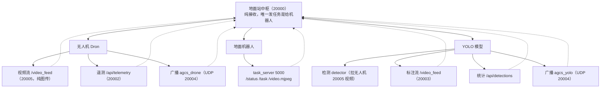

# 四仪表盘连接关键代码

这份文档按「谁发 → 中枢怎么收」的顺序，把四仪表盘之间**连接的核心代码**讲清楚。每个模块都给出实际主干代码（去掉非核心的错误处理/日志），带中文注释。

顺序：**无人机 → 地面机器人 → YOLO 模型 → 中枢自己**。

## 端口一张表

| 端口 | 归属 |
|---|---|
| 20000 / 20001 / 20002 / 20003 | 中枢 / 机器人 / 无人机 / YOLO 网页 |
| 20004 | 自动发现广播（UDP） |
| 20005 | 无人机图传视频流独立转发 |
| 5000 | 机器人 task_server（HTTP） |

---

## 一、无人机 → 中枢

无人机的视频流是「整条链路的源头」，讲细一点。

### 1.1 无人机怎么发视频流

核心就两步：**后台线程抓摄像头帧** + **一个独立 HTTP 服务把帧推出去**。

```python
# ① 抓帧：后台线程独占摄像头，把最新一帧压成 JPEG 存共享变量
latest_jpeg = None
latest_jpeg_lock = threading.Lock()

def camera_loop():
    import cv2
    cap = cv2.VideoCapture(0)              # EWRF 图传接收机 = 一个 USB 摄像头
    while True:
        ok, frame = cap.read()
        if not ok:
            continue
        ok, buf = cv2.imencode('.jpg', frame, [cv2.IMWRITE_JPEG_QUALITY, 60])
        if ok:
            with latest_jpeg_lock:
                latest_jpeg = buf.tobytes()
        time.sleep(0.02)

# ② 推流：独立服务把 latest_jpeg 一帧帧发出去（端口 20005，和网页端口分开）
from http.server import BaseHTTPRequestHandler, ThreadingHTTPServer

class _VideoHandler(BaseHTTPRequestHandler):
    def do_GET(self):
        self.send_response(200)
        self.send_header('Content-Type', 'multipart/x-mixed-replace; boundary=frame')
        self.end_headers()
        while True:
            with latest_jpeg_lock:
                jpg = latest_jpeg
            if jpg:
                # MJPEG 流：每帧前面加一个 boundary 头，浏览器/下游就能连续读图
                self.wfile.write(b'--frame\r\nContent-Type: image/jpeg\r\n\r\n' + jpg + b'\r\n')
            time.sleep(0.1)

# 启动：独立线程跑这个服务
ThreadingHTTPServer(('0.0.0.0', 20005), _VideoHandler).serve_forever()
```

> 关键点：`camera_loop` 一直抓帧，`_VideoHandler` 一直推帧，两者通过 `latest_jpeg`（带锁的共享变量）解耦——**生产者/消费者**模式，多人同时拉流也不会重复抢摄像头。

### 1.2 中枢怎么收无人机视频

中枢不重新编码，直接**原样转发**（MJPEG 代理），把无人机的流变成自己的路由 `/drone_video_feed`：

```python
@app.route('/drone_video_feed')
def drone_video_feed():
    # 连无人机的视频端口，拿到流
    upstream = requests.get('http://无人机IP:20005/video_feed', stream=True, timeout=5)

    def gen():
        for chunk in upstream.iter_content(1024):   # 一块一块原样转发
            if chunk:
                yield chunk

    ctype = upstream.headers.get('Content-Type', 'multipart/x-mixed-replace; boundary=frame')
    return Response(gen(), mimetype=ctype)
```

前端 `` 就能看到无人机纯图传。

### 1.3 无人机遥测（数据，不是视频）

无人机把 SDK 读到的数据存成字典，暴露成 JSON：

```python
# 无人机端：/api/telemetry 直接返回共享数据字典
@app.route('/api/telemetry')
def telemetry():
    return jsonify(DATA)   # DATA 里有 roll/pitch/yaw/loc_x/y 等
```

中枢定时去拉，整理后给前端：

```python
def _pull_drone_dashboard():
    resp = requests.get(_effective_drone_url() + '/api/telemetry', timeout=3)
    data = resp.json()
    # 把 SDK 的厘米转成米、拼 pose 等，写进 drone_status 供前端读
    drone_status = {'online': True, 'pose': {'x': data['loc_x']/100, ...}, ...}
```

---

## 二、地面机器人 → 中枢

### 2.1 机器人怎么发

机器人（树莓派）上跑 `task_server.py`（端口 5000），它干三件事：

- `/video.mjpeg`：把机器人摄像头每一帧 `publish_frame()` 压 JPEG 推流；
- `/status`：返回状态（state / position_m / heading_deg / picked_count …）；
- `/task`：接收任务。

核心就是「抓帧 → 压 JPEG → MJPEG 推流」，和无人机 `camera_loop` 思路一样，只是跑在树莓派上。

### 2.2 中枢怎么收

中枢三个路由，全是**代理转发**（自己不处理画面）：

```python
# ① 画面
@app.route('/robot_video_feed')
def robot_video_feed():
    upstream = requests.get(config.ROBOT_URL + '/video.mjpeg', stream=True, timeout=5)
    def gen():
        for chunk in upstream.iter_content(1024):
            if chunk:
                yield chunk
    return Response(gen(), mimetype='multipart/x-mixed-replace; boundary=frame')

# ② 状态
@app.route('/api/robot/status')
def api_robot_status():
    r = requests.get(config.ROBOT_URL + '/status', timeout=2)
    return jsonify(r.json())

# ③ 下发任务（中枢唯一「主动发」的地方）
@app.route('/api/task', methods=['POST'])
def api_task():
    task = request.get_json(force=True)
    r = requests.post(config.ROBOT_URL + '/task', json=task, timeout=5)
    return jsonify(r.json()), r.status_code
```

---

## 三、YOLO 模型 → 中枢

### 3.1 YOLO 怎么发（拉无人机视频 → 检测 → 推标注流）

YOLO 节点**先当接收方**拉无人机的视频，检测画框后**再当发送方**推出去：

```python
def _yolo_monitor():
    detector = YoloDetector('best.onnx')   # 加载模型（.onnx 用 onnxruntime，.pt 用 ultralytics）

    # 拉无人机视频（20005），逐帧处理
    for jpg in _iter_mjpeg_frames('http://无人机IP:20005/video_feed'):
        frame = cv2.imdecode(np.frombuffer(jpg, np.uint8), cv2.IMREAD_COLOR)  # JPEG → 图像
        frame, dets = detector.detect(frame)   # 检测 + 在 frame 上画绿框
        # 把标注后的帧压回 JPEG 存共享变量
        ok, buf = cv2.imencode('.jpg', frame, [cv2.IMWRITE_JPEG_QUALITY, 70])
        if ok:
            with latest_jpeg_lock:
                latest_jpeg = buf.tobytes()
```

然后把 `latest_jpeg` 用和无人机一样的 MJPEG 方式推出去（`/video_feed`，端口 20003），同时把检测统计暴露成 `/api/detections`。

### 3.2 中枢怎么收 YOLO 标注流

和收无人机视频一模一样，转发成 `/video.mjpeg`：

```python
@app.route('/video.mjpeg')
def video_mjpeg():
    # 拉 YOLO 的标注流，原样转发
    upstream = requests.get(_effective_yolo_url() + '/video_feed', stream=True)
    def gen():
        for chunk in upstream.iter_content(1024):
            if chunk:
                yield chunk
    return Response(gen(), mimetype='multipart/x-mixed-replace; boundary=frame')
```

### 3.3 MJPEG 逐帧切图（YOLO 用到的关键函数）

视频流是连续字节，要按 JPEG 的**帧头 `FF D8` / 帧尾 `FF D9`** 切成一帧帧：

```python
def _iter_mjpeg_frames(url):
    resp = requests.get(url, stream=True, timeout=5)
    buf = b''
    for chunk in resp.iter_content(4096):
        buf += chunk
        while True:
            start = buf.find(b'\xff\xd8')          # 帧头
            if start < 0:
                break
            end = buf.find(b'\xff\xd9', start + 2) # 帧尾
            if end < 0:
                buf = buf[start:]
                break
            yield buf[start:end + 2]               # 吐出一帧完整 JPEG
            buf = buf[end + 2:]
```

---

## 四、中枢自己独立的东西

中枢除了上面「收三路」，还有两块自己的逻辑。

### 4.1 UDP 广播自动发现（不用手填 IP）

无人机 / YOLO 每 2 秒广播自己；中枢蹲在 UDP 20004 听，自动记下地址。

**广播端**（无人机/YOLO）：

```python
def _beacon_loop():
    sock = socket.socket(socket.AF_INET, socket.SOCK_DGRAM)
    sock.setsockopt(socket.SOL_SOCKET, socket.SO_BROADCAST, 1)
    while True:
        msg = json.dumps({'type': 'agcs_drone', 'port': 20002}).encode()  # YOLO 用 agcs_yolo
        sock.sendto(msg, ('255.255.255.255', 20004))
        time.sleep(2)
```

**监听端**（中枢）：

```python
def _discovery_loop():
    sock = socket.socket(socket.AF_INET, socket.SOCK_DGRAM)
    sock.setsockopt(socket.SOL_SOCKET, socket.SO_REUSEADDR, 1)
    sock.bind(('0.0.0.0', 20004))
    while True:
        data, addr = sock.recvfrom(2048)      # addr[0] 就是对方 IP
        info = json.loads(data)
        if info['type'] == 'agcs_drone':
            DISCOVERED_DRONE = 'http://%s:%d' % (addr[0], info['port'])
        elif info['type'] == 'agcs_yolo':
            DISCOVERED_YOLO = 'http://%s:%d' % (addr[0], info['port'])
```

> 关键点：广播**只带端口不带 IP**，IP 由 `recvfrom` 的源地址拿到——对方有几块网卡都不会选错。

### 4.2 地址优先级（配置 IP 优先，广播发现兜底）

```python
def _effective_drone_url():
    base = config.DRONE_URL                       # yaml 里写的地址
    host = base.split('://')[-1].split(':')[0] if base else ''
    disc = DISCOVERED_DRONE                        # 广播发现的地址
    # 配置没写、或写的是 127.0.0.1 时，用广播发现的
    if disc and (not base or host in ('127.0.0.1', 'localhost')):
        return disc
    return base or disc

def _drone_video_url():
    # 无人机视频在独立端口（20005），和遥测端口（20002）分开
    host = _effective_drone_url().split('://')[-1].split(':')[0]
    return 'http://%s:%d' % (host, config.DRONE_VIDEO_PORT)
```

### 4.3 下发任务给机器人（中枢唯一「发」）

见「二、地面机器人」里的 `POST /api/task`——把前端填的坐标转成任务发给 task_server。

---

## 数据流总图



- **实线 `-->` = 管理层级**：中枢在最上面，下面分管无人机 / 机器人 / YOLO 三个仪表盘，各自再带自己的服务。
- **虚线 `-.->` = 直连中枢**：这些服务把数据直接发到中枢（从下面接上来），中枢纯接收；中枢唯一往外发的是给机器人下发任务（`POST /api/task`）。

## 三条关键约定

1. **广播只带端口不带 IP**，接收方用 `recvfrom` 的源 IP 拼 URL。
2. **配置 IP 优先**：yaml 写了局域网 IP 就用配置；`127.0.0.1`/空 时用广播发现兜底。
3. **改端口要重启**，其余配置保存即热重载。 
